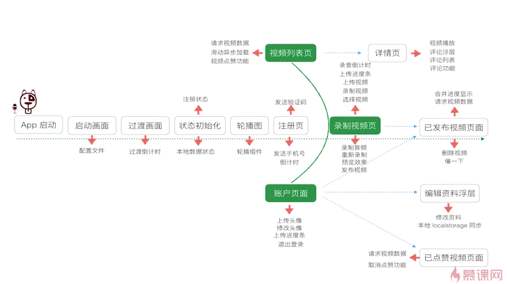
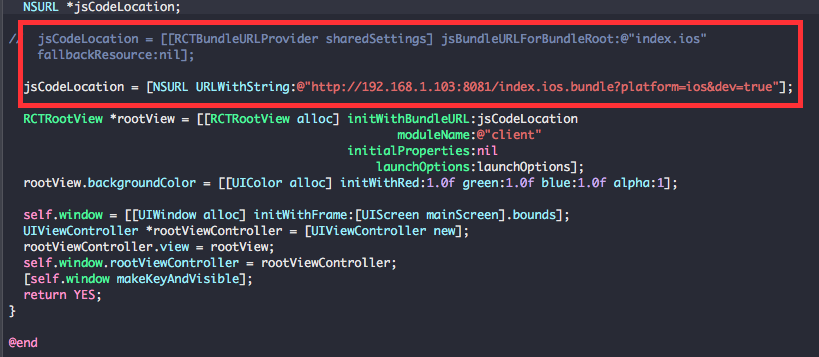

# DogSay	狗狗说
> an app by react native

对于慕课网的学习记录[贯穿全栈React Native开发App](http://coding.imooc.com/learn/list/56.html)

## 希望达成的目标
* 用es6写（视频是es5风格）
* 用redux进行项目的架构
* 适配ios跟安卓（视频只适配了ios）

## 使用的第三方库or组件
### client
> * [react-native-scrollable-tab-view](https://github.com/skv-headless/react-native-scrollable-tab-view)
> * [react-native-vector-icons](https://github.com/oblador/react-native-vector-icons)
> * [rnpm](https://github.com/rnpm/rnpm)
> * [react-mixin](https://github.com/brigand/react-mixin)
> * [query-string](https://github.com/sindresorhus/query-string)
> * [lodash](https://github.com/lodash/lodash)

## app的大致流程图

## 快速创建后台和Mock假数据
* [Rap](http://rap.taobao.org/org)
* [Mockjs](http://mockjs.com/)

## 参考资料
[ReactNative中文网](http://reactnative.cn/docs/0.31/getting-started.html)

[江清清的技术专栏](http://www.lcode.org/)

## 遇到的问题
1. 用ipad真机调试没有热加载的设置
> 

2. 图片(http)在ios上不能显示不能显示	
> [iOS9 HTTP 不能正常使用的解决办法](https://segmentfault.com/a/1190000002933776)

	
